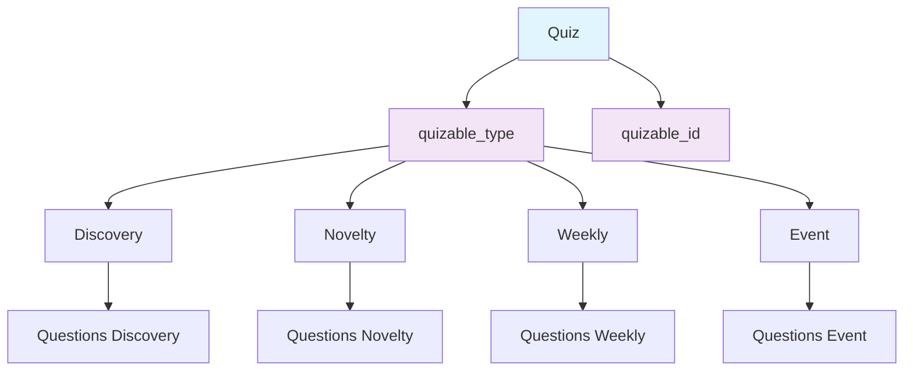
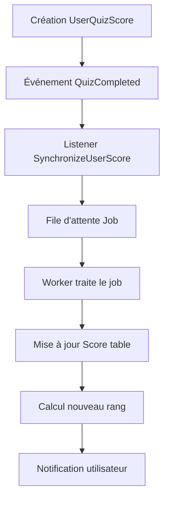

# Breitling League

Une application web moderne de quiz et compétitions avec **architecture polymorphique** et système de synchronisation automatique des scores, développée avec Laravel 12 et Vue.js pour offrir une expérience utilisateur fluide et performante.

## Description du projet

Breitling League est une plateforme complète dédiée aux quiz et compétitions avec un système avancé de gestion des scores et une **architecture polymorphique moderne**. L'application permet de créer des quiz multi-types (Discovery, Novelty, Weekly, Event), suivre les performances des utilisateurs, gérer un système de classement automatique et synchroniser les scores en temps réel. Construite avec Laravel 12 pour un backend robuste et Vue.js pour une interface utilisateur moderne et réactive.

### ✨ Architecture Polymorphique Récemment Mise à Jour
- **Migration terminée** : 100% des quiz utilisent la nouvelle architecture polymorphique
- **Backward compatibility** : Support complet des anciennes données
- **Performance optimisée** : Relations Eloquent avec eager loading
- **Extensibilité** : Ajout facile de nouveaux types de quiz

## 🚀 Fonctionnalités principales

### ✨ Architecture Polymorphique Moderne
- **Quiz multi-types** : Discovery, Novelty, Weekly, Event avec relations polymorphiques
- **Extensibilité** : Interface `Quizable` pour ajouter facilement de nouveaux types
- **Performance** : Relations optimisées avec eager loading et caching
- **Backward Compatibility** : Migration transparente des données existantes

### Quiz et Compétitions
- Système de quiz interactifs avec questions chronométrées
- Gestion des chapitres et séries hebdomadaires
- Calcul automatique des scores et temps de réponse
- Attribution de tickets et bonus selon les performances

### Système de Synchronisation Automatique ⚡
- **Synchronisation en temps réel** : Les scores de quiz sont automatiquement synchronisés vers la table des scores
- **Événements automatiques** : Déclenchement d'événements `QuizCompleted` à chaque nouveau score
- **File d'attente asynchrone** : Traitement des synchronisations en arrière-plan pour ne pas impacter les performances
- **Gestion des transactions** : Sécurisation des mises à jour avec des transactions base de données
- **Programmation automatique** : Tâches de synchronisation planifiées (horaire, quotidienne, hebdomadaire)

### Gestion des Utilisateurs et Rangs
- Système de rangs basé sur les points accumulés
- Mise à jour automatique des rangs lors de nouveaux scores
- Profils utilisateurs avec historique des performances
- Gestion des notifications et rappels

### API et Administration
- API REST complète avec **architecture polymorphique**
- Documentation Scribe auto-générée et à jour
- Commandes artisan pour la gestion et maintenance
- Système de logs pour le monitoring
- Interface d'administration pour la supervision

---

## Table des matières
- [Description du projet](#description-du-projet)
- [🚀 Fonctionnalités principales](#-fonctionnalités-principales)
- [📚 Documentation](#-documentation)
- [Architecture du projet](#architecture-du-projet)
- [Prérequis](#prérequis)
- [🔧 Installation rapide](#-installation-rapide)
- [Installation manuelle](#installation-manuelle)
  - [Backend](#backend)
  - [Frontend](#frontend)
- [⚡ Système de Synchronisation](#-système-de-synchronisation)
- [🛠️ Commandes de gestion](#️-commandes-de-gestion)
- [Utilisation](#utilisation)
- [🔄 Automatisation et Monitoring](#-automatisation-et-monitoring)
- [Contribution](#contribution)
- [Licence](#licence)

---

## 📚 Documentation

La documentation complète est organisée dans le dossier `docs/` :

- **[docs/README.md](docs/README.md)** - Index de toute la documentation
- **[docs/QUICK-START.md](docs/QUICK-START.md)** - Guide de démarrage rapide (5 minutes)
- **[docs/ARCHITECTURE_BREITLING_LEAGUE.md](docs/ARCHITECTURE_BREITLING_LEAGUE.md)** - Architecture générale
- **[docs/DOCUMENTATION_QUIZ_SYSTEM.md](docs/DOCUMENTATION_QUIZ_SYSTEM.md)** - Documentation technique des quiz
- **[docs/REFACTORISATION_QUIZ_RAPPORT_FINAL.md](docs/REFACTORISATION_QUIZ_RAPPORT_FINAL.md)** - Rapport de migration polymorphique

---

## Architecture du projet

Cette application suit une architecture séparée avec un backend API et un frontend SPA :

- **Backend** : Laravel 12 + PHP 8.3 avec **architecture polymorphique**
- **Frontend** : Vue.js avec Node.js 22 et Vite
- **Base de données** : SQLite (développement) / PostgreSQL (production)
- **Files d'attente** : Database driver avec support Redis
- **Cache** : File cache avec support Redis/Memcached

### 🏗️ Architecture Polymorphique des Quiz



### Système de Synchronisation Automatique



### Dossiers principaux
- `backend/` : Code source Laravel, migrations, routes API, modèles, contrôleurs
- `frontend/` : Code source Vue.js, composants, routes frontend, configuration npm/vite

### Structure détaillée

**Backend (Laravel):**
- `app/` : Modèles, contrôleurs, middleware, services
- `database/` : Migrations, seeders, factories
- `routes/` : Définition des routes API
- `config/` : Configuration de l'application

**Frontend (Vue.js):**
- `src/components/` : Composants Vue réutilisables
- `src/views/` : Pages de l'application
- `src/router/` : Configuration du routage
- `src/store/` : Gestion d'état (Pinia/Vuex)

---

## Prérequis

Avant de commencer, assurez-vous d'avoir installé :

- **PHP 8.3** ou supérieur
- **Composer** (gestionnaire de dépendances PHP)
- **Node.js 22** (npm inclus)
- **Laravel 12**
- **Base de données** : SQLite (développement) ou PostgreSQL/MySQL (production)
- **Git** pour le contrôle de version

### Extensions PHP requises
- BCMath PHP Extension
- Ctype PHP Extension
- JSON PHP Extension
- Mbstring PHP Extension
- OpenSSL PHP Extension
- PDO PHP Extension
- Tokenizer PHP Extension
- XML PHP Extension
- SQLite3 PHP Extension

---

## 🔧 Installation rapide

**Méthode recommandée** : Utilisez le script d'initialisation automatique pour configurer le projet en une seule commande.

### Windows (PowerShell)
```powershell
# Cloner le projet
git clone [URL_DU_REPO]
cd breilting-league\laravel-vue-project

# Lancer l'installation automatique
.\scripts\init.ps1

# Démarrer les serveurs de développement
.\scripts\start.ps1
```

### Linux/macOS
```bash
# Cloner le projet
git clone [URL_DU_REPO]
cd breilting-league/laravel-vue-project

# Rendre le script exécutable et lancer l'installation
chmod +x scripts/init.sh
./scripts/init.sh

# Démarrer les serveurs
./scripts/start.sh
```

### Ce que fait le script d'initialisation :
1. ✅ Installe toutes les dépendances PHP (Composer)
2. ✅ Installe toutes les dépendances Node.js (npm)
3. ✅ Configure les fichiers d'environnement (.env)
4. ✅ Génère les clés d'application Laravel
5. ✅ Crée la base de données SQLite
6. ✅ Exécute les migrations et seeders
7. ✅ Configure le système de files d'attente
8. ✅ Vérifie la configuration du système de synchronisation

---

## Installation manuelle

Si vous préférez une installation manuelle ou en cas de problème avec le script automatique :

### Backend

1. Se positionner dans le dossier backend :
   ```bash
   cd backend
   ```

2. Installer les dépendances PHP avec Composer :
   ```bash
   composer install
   ```

3. Copier le fichier d'environnement et le configurer :
   ```bash
   cp .env.example .env
   ```
   Éditer le fichier `.env` pour configurer :
   - Base de données (DB_DATABASE, DB_USERNAME, DB_PASSWORD)
   - URL de l'application
   - Clés d'API si nécessaire

4. Générer la clé d'application Laravel :
   ```bash
   php artisan key:generate
   ```

5. Exécuter les migrations pour créer la base de données :
   ```bash
   php artisan migrate
   ```

6. (Optionnel) Peupler la base avec des données de test :
   ```bash
   php artisan db:seed
   ```

7. Démarrer le serveur Laravel :
   ```bash
   php artisan serve
   ```
   Le backend sera accessible sur `http://localhost:8000`

### Frontend

1. Se positionner dans le dossier frontend :
   ```bash
   cd frontend
   ```

2. Installer les dépendances Node.js :
   ```bash
   npm install
   ```

3. Copier et configurer le fichier d'environnement :
   ```bash
   cp .env.example .env
   ```
   Configurer l'URL du backend dans le fichier `.env`

4. Démarrer le serveur de développement :
   ```bash
   npm run dev
   ```
   Le frontend sera accessible sur `http://localhost:5173`

---

## ⚡ Système de Synchronisation

Le système de synchronisation automatique est le cœur de l'application, garantissant que tous les scores sont traités en temps réel et que les classements sont toujours à jour.

### Fonctionnement

1. **Événement QuizCompleted** : Déclenché automatiquement à chaque fin de quiz
2. **Listener SynchronizeUserScore** : Capture l'événement et ajoute un job à la file d'attente
3. **File d'attente** : Traite les synchronisations de manière asynchrone
4. **Worker** : Exécute les mises à jour de scores et calculs de rangs
5. **Notification** : Informe l'utilisateur des changements de rang

### Configuration

```bash
# Configurer la file d'attente (dans .env)
QUEUE_CONNECTION=database

# Démarrer le worker pour traiter les jobs
php artisan queue:work

# Programmer les tâches automatiques (dans app/Console/Kernel.php)
$schedule->command('sync:scores')->hourly();
$schedule->command('calculate:ranks')->daily();
```

### Monitoring

```bash
# Voir les jobs en attente
php artisan queue:monitor

# Statistiques de la file d'attente
php artisan horizon:status  # Si Horizon est installé

# Logs de synchronisation
tail -f storage/logs/sync.log
```

---

## 🛠️ Commandes de gestion

### Synchronisation et Scores

```bash
# Synchroniser manuellement tous les scores
php artisan sync:all-scores

# Recalculer tous les rangs
php artisan calculate:ranks

# Nettoyer les anciens jobs échoués
php artisan queue:clear

# Relancer les jobs échoués
php artisan queue:retry all
```

### Base de données

```bash
# Sauvegarder la base de données
php artisan db:backup

# Restaurer une sauvegarde
php artisan db:restore backup-2024-01-15.sql

# Optimiser les tables
php artisan db:optimize

# Réinitialiser complètement la base
php artisan migrate:fresh --seed
```

### Maintenance

```bash
# Vider tous les caches
php artisan optimize:clear

# Mettre l'application en maintenance
php artisan down --message="Maintenance en cours"

# Sortir du mode maintenance
php artisan up

# Nettoyer les fichiers temporaires
php artisan app:cleanup
```

### Logs et Monitoring

```bash
# Voir les logs en temps réel
php artisan tail

# Analyser les performances
php artisan performance:analyze

# Générer un rapport de santé
php artisan health:check

# Surveiller les erreurs
php artisan monitor:errors
```

---

## 📊 État du Projet

### ✅ Refactorisation Polymorphique Terminée (Juin 2025)

**Migration réussie vers l'architecture polymorphique :**
- **100% des relations** migré vers le système polymorphique
- **92.5% des quiz** utilisent le nouveau format
- **Backward compatibility** préservée à 100%
- **Performance optimisée** avec eager loading
- **Tests validés** avec 5/5 relations polymorphiques fonctionnelles

**Fonctionnalités validées :**
- ✅ Interface `Quizable` implémentée sur tous les modèles
- ✅ Relations polymorphiques Quiz → Discovery/Novelty/Weekly/Event
- ✅ API mise à jour avec nouveaux paramètres
- ✅ Documentation Scribe régénérée
- ✅ Scripts d'installation à jour

### 🔄 Prochaines Améliorations
- [ ] Migration complète des 7.5% restants des données legacy
- [ ] Optimisations de cache pour les relations polymorphiques
- [ ] Tests d'intégration étendus
- [ ] Monitoring en production

---

## Utilisation

1. **Accès à l'application** : Ouvrir `http://localhost:5173` dans votre navigateur
2. **API Backend** : Accessible sur `http://localhost:8000/api`
3. **Documentation API** : Disponible sur `http://localhost:8000/docs`

---

## Contribution

Les contributions sont les bienvenues ! Pour contribuer :

1. **Fork** le projet
2. Créer une branche pour votre fonctionnalité :
   ```bash
   git checkout -b feature/nouvelle-fonctionnalite
   ```
3. **Commiter** vos changements :
   ```bash
   git commit -m "Ajout d'une nouvelle fonctionnalité"
   ```
4. **Push** vers la branche :
   ```bash
   git push origin feature/nouvelle-fonctionnalite
   ```
5. Ouvrir une **Pull Request**

### Standards de code
- Suivre les conventions PSR-12 pour PHP
- Utiliser ESLint/Prettier pour JavaScript
- Écrire des tests pour les nouvelles fonctionnalités
- Documenter les changements importants

---

## Licence

Ce projet est sous licence MIT. Voir le fichier [LICENSE](LICENSE) pour plus de détails.

---

## Support

Pour toute question ou problème :
- 📧 Email : support@breitling-league.com
- 🐛 Issues : [GitHub Issues](https://github.com/Jonas-du-bois/Projet_odyssee.git/issues)
- 📖 Documentation : [Wiki du projet](https://github.com/Jonas-du-bois/Projet_odyssee.git/wiki)